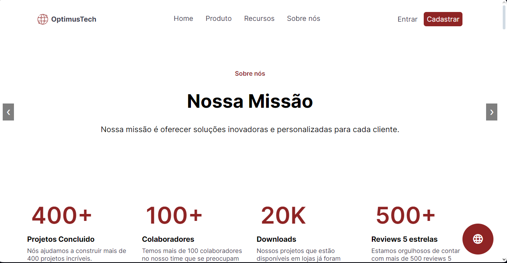
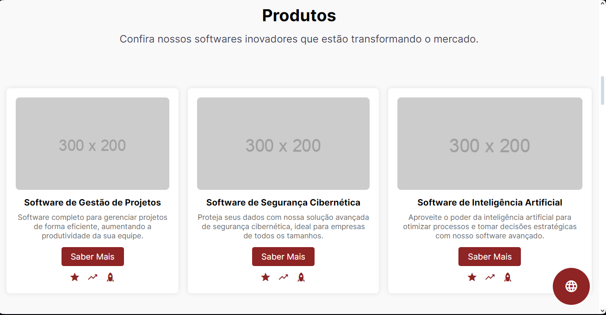
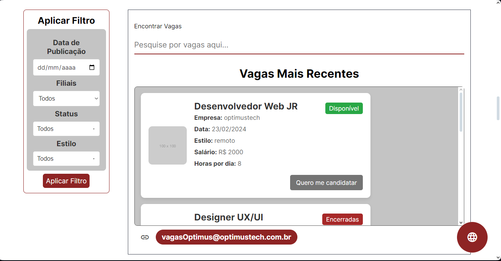
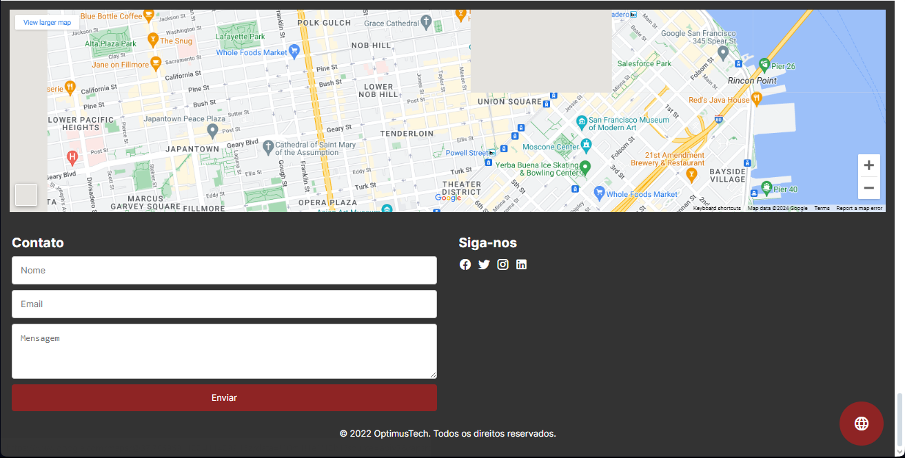

# OptimusTech 🌏


## Descrição
OptimusTech 🌏 é uma plataforma informativa que visa fornecer informações sobre a empresa, seus produtos, vagas de emprego, artigos do blog e muito mais.

## Conteúdo
- [Visão Geral](#visão-geral)
- [Tecnologias Utilizadas](#tecnologias-utilizadas)
- [Instalação](#instalação)
- [Como Usar](#como-usar)
- [Contribuição](#contribuição)
- [Licença](#licença)

## Visão Geral
Este projeto consiste em uma aplicação web que oferece várias seções:
- **Home**: Informações principais sobre a empresa.
- **Produtos**: Detalhes sobre os produtos oferecidos.
- **Vagas de Emprego**: Oportunidades disponíveis na empresa.
- **Blog**: Artigos e notícias relacionadas ao setor.
- **Equipe**: Perfil dos membros da equipe.
- **FAQ**: Perguntas frequentes respondidas.
- **Contato**: Formulário de contato e informações para se comunicar com a empresa.

## Tecnologias Utilizadas
- [](https://developer.mozilla.org/en-US/docs/Web/Guide/HTML/HTML5)
- [](https://developer.mozilla.org/en-US/docs/Web/CSS/CSS3)
- [](https://developer.mozilla.org/en-US/docs/Web/JavaScript)
- HTML5, CSS3, JavaScript

## Instalação
Para executar localmente, siga estas etapas:

1. Clone o repositório: `git clone https://github.com/seu-usuario/nome-do-repositorio.git`
2. Navegue até o diretório: `cd nome-do-repositorio`
3. Abra o arquivo `index.html` no seu navegador.

## Como Usar
- Navegue pelas diferentes seções usando a barra de navegação.
- Explore produtos, vagas de emprego, artigos do blog e informações sobre a equipe.

## Adicionar Vagas:
Você pode adicionar novas vagas de emprego editando o arquivo `vagas.json` conforme o exemplo abaixo que faz uma simulação API:

> [!IMPORTANT]
> Para Editar as Vagas Você precias entrar em `api`


```json
[
    {
        "img": "https://via.placeholder.com/100",
        "empresa": "optimustech",
        "nome": "Desenvolvedor Web JR",
        "disponibilidade": "open",
        "data": "23/02/2024",
        "estilo": "remoto",
        "salario": 2000,
        "horas_dia": 8
    },
    {
        "img": "https://via.placeholder.com/100",
        "empresa": "optimustech",
        "nome": "Designer UX/UI",
        "disponibilidade": "close",
        "data": "01/02/2024",
        "estilo": "presencial",
        "salario": 2500,
        "horas_dia": 7
    },
    ...
]

```
> [!CAUTION]
> É importante resaltar que essa vagas possuem um estado de "opne","close","warning"

## Plugins Exemplos:


> [!IMPORTANT]
> Você pode querer modificar os plugins então Entre em `plugins`

```javascript
    //Plugin de Carrosel

    let slideIndex = 0;

    function showSlides() {
        const slides = document.querySelector('.slide');
        const totalSlides = slides.children.length;
        slideIndex++;
        if (slideIndex >= totalSlides) {
            slideIndex = 0;
        }
        slides.style.transform = `translateX(${-slideIndex * 100}%)`;
    }

    function moveSlide(n) {
        slideIndex += n;
        const slides = document.querySelector('.slide');
        const totalSlides = slides.children.length;
        if (slideIndex >= totalSlides) {
            slideIndex = 0;
        } else if (slideIndex < 0) {
            slideIndex = totalSlides - 1;
        }
        slides.style.transform = `translateX(${-slideIndex * 100}%)`;
    }

    setInterval(showSlides, 4000);

```
<hr>





## Licença
Este projeto é licenciado sob a MIT. Veja o arquivo [LICENSE](./LICENSE) para mais detalhes.

---

**OptimusTech 🌏** - Criado por [Divizioon](https://github.com/dvizioon)
